---
## Front matter
title: "Отчет по лабораторной работе номер 4"
subtitle: "Операционные системы"
author: "Кузнецова Елизавета Анреевна"

## Generic otions
lang: ru-RU
toc-title: "Содержание"

## Bibliography
bibliography: bib/cite.bib
csl: pandoc/csl/gost-r-7-0-5-2008-numeric.csl

## Pdf output format
toc: true # Table of contents
toc-depth: 2
lof: true # List of figures
lot: true # List of tables
fontsize: 12pt
linestretch: 1.5
papersize: a4
documentclass: scrreprt
## I18n polyglossia
polyglossia-lang:
  name: russian
  options:
	- spelling=modern
	- babelshorthands=true
polyglossia-otherlangs:
  name: english
## I18n babel
babel-lang: russian
babel-otherlangs: english
## Fonts
mainfont: PT Serif
romanfont: PT Serif
sansfont: PT Sans
monofont: PT Mono
mainfontoptions: Ligatures=TeX
romanfontoptions: Ligatures=TeX
sansfontoptions: Ligatures=TeX,Scale=MatchLowercase
monofontoptions: Scale=MatchLowercase,Scale=0.9
## Biblatex
biblatex: true
biblio-style: "gost-numeric"
biblatexoptions:
  - parentracker=true
  - backend=biber
  - hyperref=auto
  - language=auto
  - autolang=other*
  - citestyle=gost-numeric
## Pandoc-crossref LaTeX customization
figureTitle: "Рис."
tableTitle: "Таблица"
listingTitle: "Листинг"
lofTitle: "Список иллюстраций"
lotTitle: "Список таблиц"
lolTitle: "Листинги"
## Misc options
indent: true
header-includes:
  - \usepackage{indentfirst}
  - \usepackage{float} # keep figures where there are in the text
  - \floatplacement{figure}{H} # keep figures where there are in the text
---

# Цель работы

Получение навыков правильной работы с репозиториями git.

# Задание

1. Создать новый репозиторий на github.
2. Проивести все коммиты.
3. ЗАгрузить отчет на github.
4. Преобразовать рабочий репозиторий в репозиторий с git-flow и conventional commits.

# Теоретическое введение

Gitflow Workflow опубликована и популяризована Винсентом Дриссеном.
Gitflow Workflow предполагает выстраивание строгой модели ветвления с учётом выпуска проекта.
Данная модель отлично подходит для организации рабочего процесса на основе релизов.
Работа по модели Gitflow включает создание отдельной ветки для исправлений ошибок в рабочей среде.
Когда работа над веткой исправления hotfix завершена, она сливается в ветки develop и master.
Ветки поддержки или ветки hotfix используются для быстрого внесения исправлений в рабочие релизы. Они создаются от ветки master. Это единственная ветка, которая должна быть создана непосредственно от master. Как только исправление завершено, ветку следует объединить с master и develop. Ветка master должна быть помечена обновлённым номером версии.

# Выполнение лабораторной работы

В суперпользователе установили установили git-flow. Воспользовались командами dnf. Install помог нам скачать gitflow (рис. [-@fig:001]).

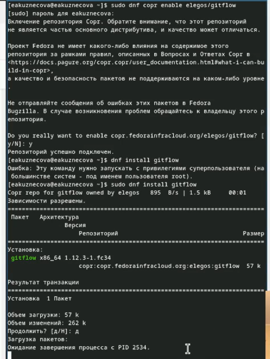{#fig:001 width=80%}

Установка Node.js. В суперпользователе вводим команду dnf pnpm (рис. [-@fig:002]).

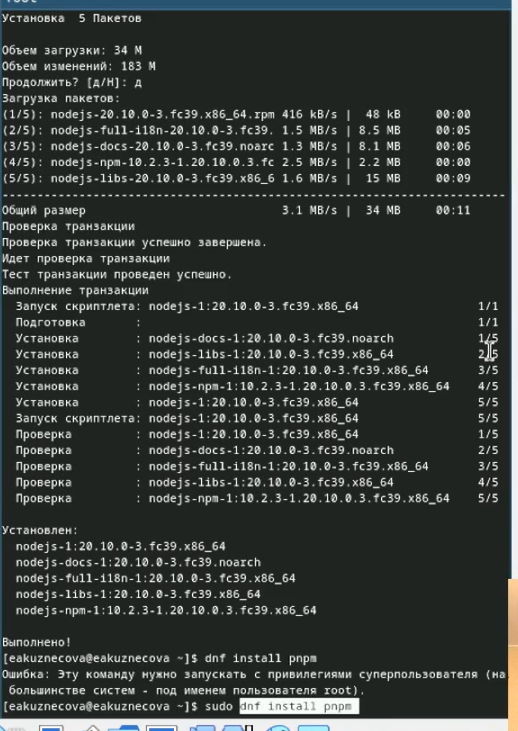{#fig:002 width=80%}

Продолжение установки. Соглашаемся с этим продолжением (рис. [-@fig:003]).

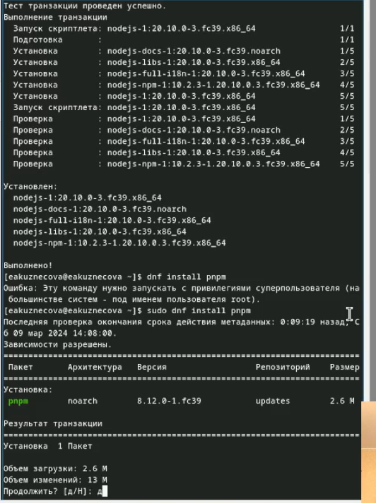{#fig:003 width=80%}

Настройка Node.js. Запустили pnpm setup. Выполнили source ~/.bashrc (рис. [-@fig:004]).

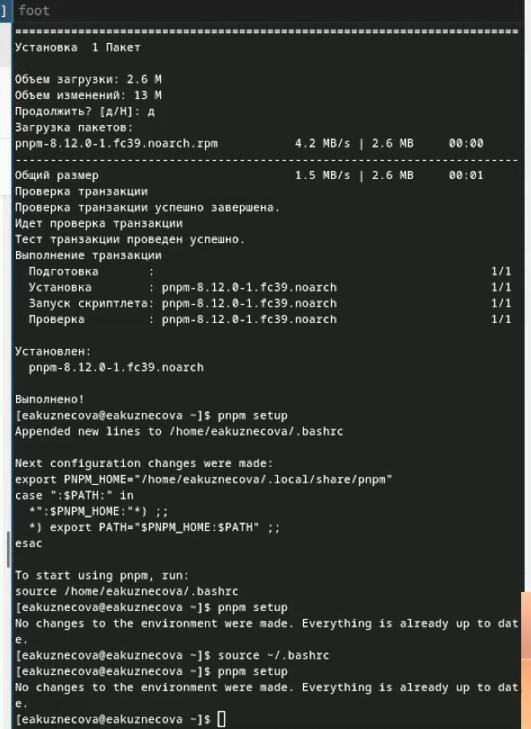{#fig:004 width=80%}

Используем общепринятые коммиты: pnpm add -g commitizen, pnpm add -g standard-changelog. Установили git-cz (рис. [-@fig:005]).

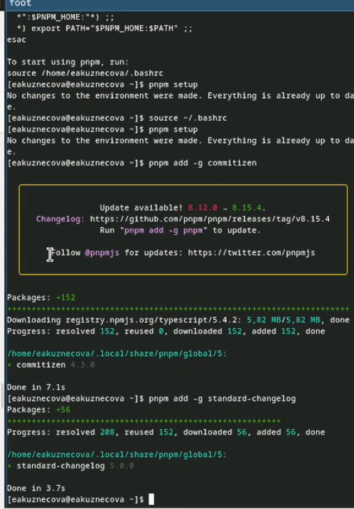{#fig:005 width=80%}

Создаем репозиторий на github. Клонируем его (рис. [-@fig:006]).

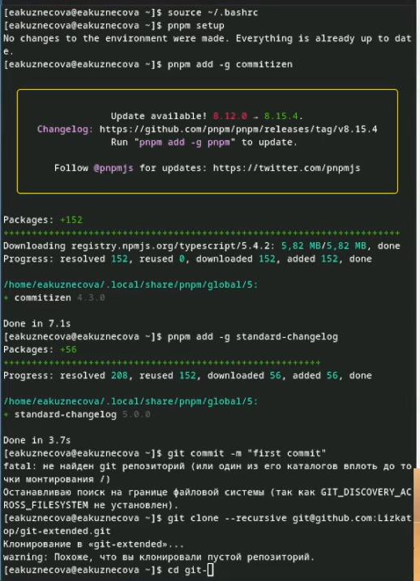{#fig:006 width=80%}

Делаем первый коммит. Он не получается. Создаем README.md. Снова делаем первый коммит. Он сработал. Внешний репозиторий origin существует, коммит не нужен  (рис. [-@fig:007]).

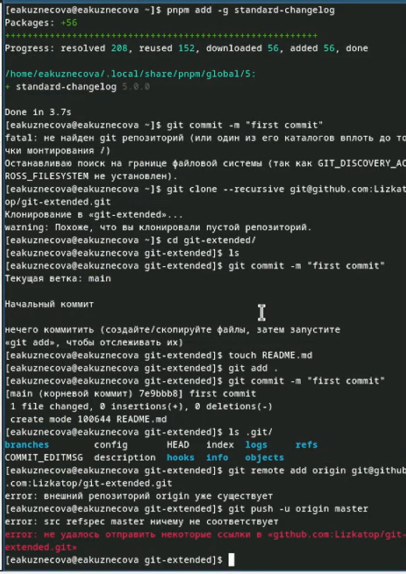{#fig:007 width=80%}

Конфигурируем общепринятые коммиты. Перед этим переходим в созданный репозиторий (рис. [-@fig:008]).

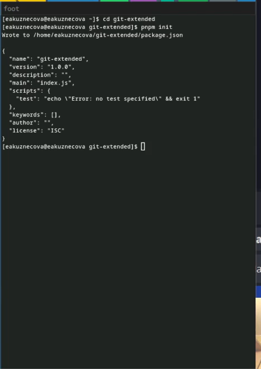{#fig:008 width=80%}

С помощью nano редактируем файл package.json (рис. [-@fig:009]).

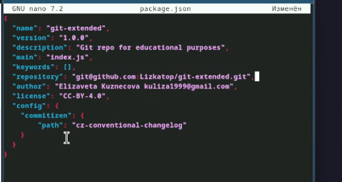{#fig:009 width=80%}

Добавляем новые файлы с помощью команды git add . Выполняем коммит. Отправляем файлы на github  (рис. [-@fig:010]).

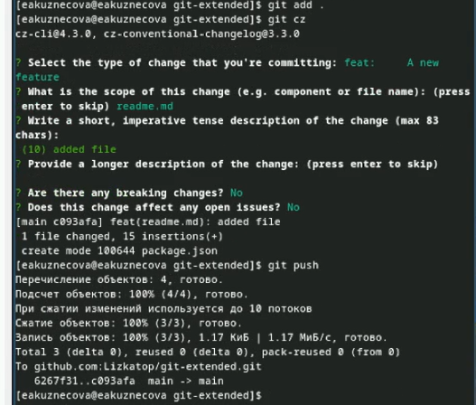{#fig:010 width=80%}

Инициализируем git-flow -f. Проверяем, что мы на ветке develop (рис. [-@fig:011]).

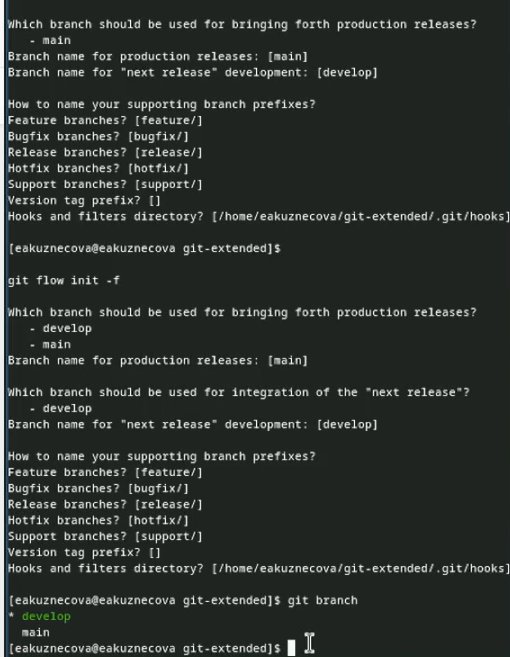{#fig:011 width=80%}

Загружаем весь репозиторий в хранилище. Уставливаем внешнюю ветку выше. Создаем релиз с версией 1.0.0. Создаем журнал изменений. Добавляем жупрнал измений в индекс. Заливаем релизную ветку в основную  (рис. [-@fig:012]).

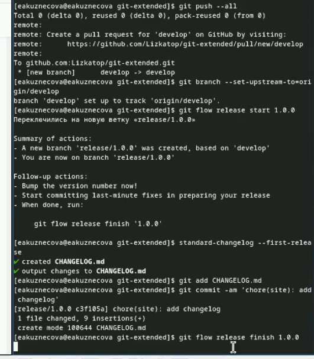{#fig:012 width=80%}

Отправляем данные на github (рис. [-@fig:013]).

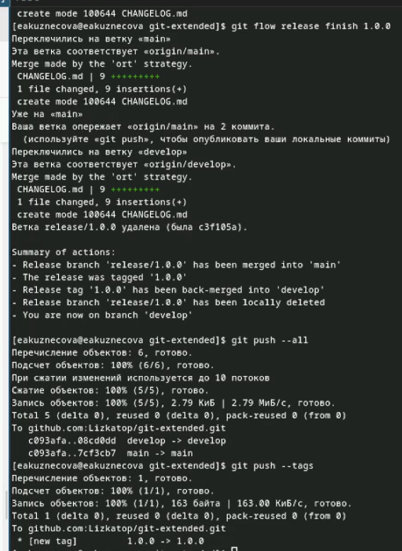{#fig:013 width=80%}

Создаем релиз на github. Создаем ветку для новой функциональности. Объединяем ветки. Создаем релиз с версией 1.2.3  (рис. [-@fig:014]).

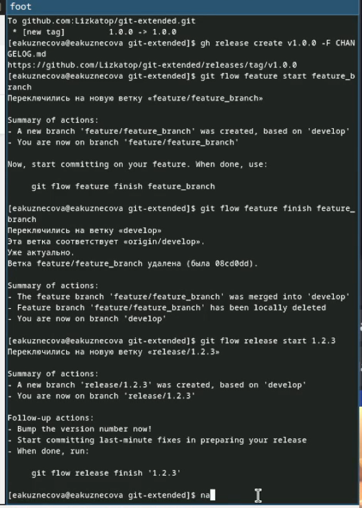{#fig:014 width=80%}

С помощью утилита nano редактируем файл package.json (рис. [-@fig:015]).

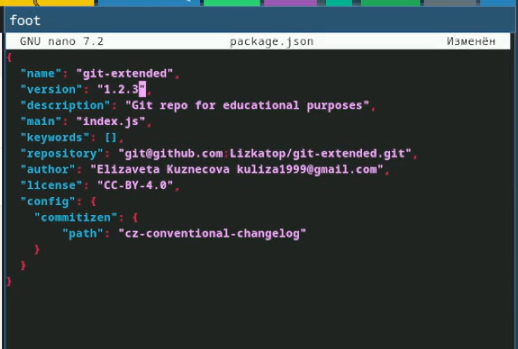{#fig:015 width=80%}

Создаем журнал изменений. Добавляем журанл в индекс. Релизную ветку заливаем в основную. Начинаем отпрваку данных на github (рис. [-@fig:016]).

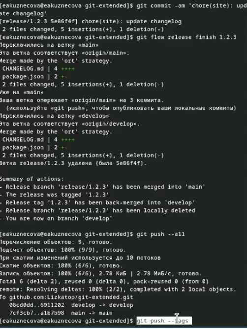{#fig:016 width=80%}

Создаем релиз на github с комментарием из журнала изменений (рис. [-@fig:018]).

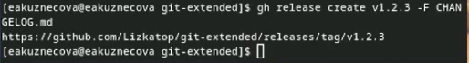{#fig:018 width=80%}

# Выводы

Были получены навыки правильной работы с репозиториями git.
