---
## Front matter
title: "Лабораторная работа номер 6"
subtitle: "Операционные системы"
author: "Кузнецова Елизавета Андреевна"

## Generic otions
lang: ru-RU
toc-title: "Содержание"

## Bibliography
bibliography: bib/cite.bib
csl: pandoc/csl/gost-r-7-0-5-2008-numeric.csl

## Pdf output format
toc: true # Table of contents
toc-depth: 2
lof: true # List of figures
lot: true # List of tables
fontsize: 12pt
linestretch: 1.5
papersize: a4
documentclass: scrreprt
## I18n polyglossia
polyglossia-lang:
  name: russian
  options:
	- spelling=modern
	- babelshorthands=true
polyglossia-otherlangs:
  name: english
## I18n babel
babel-lang: russian
babel-otherlangs: english
## Fonts
mainfont: PT Serif
romanfont: PT Serif
sansfont: PT Sans
monofont: PT Mono
mainfontoptions: Ligatures=TeX
romanfontoptions: Ligatures=TeX
sansfontoptions: Ligatures=TeX,Scale=MatchLowercase
monofontoptions: Scale=MatchLowercase,Scale=0.9
## Biblatex
biblatex: true
biblio-style: "gost-numeric"
biblatexoptions:
  - parentracker=true
  - backend=biber
  - hyperref=auto
  - language=auto
  - autolang=other*
  - citestyle=gost-numeric
## Pandoc-crossref LaTeX customization
figureTitle: "Рис."
tableTitle: "Таблица"
listingTitle: "Листинг"
lofTitle: "Список иллюстраций"
lotTitle: "Список таблиц"
lolTitle: "Листинги"
## Misc options
indent: true
header-includes:
  - \usepackage{indentfirst}
  - \usepackage{float} # keep figures where there are in the text
  - \floatplacement{figure}{H} # keep figures where there are in the text
---

# Цель работы

Приобретение практических навыков взаимодействия пользователя с системой по-
средством командной строки.

# Задание

1. Познакомиться с командой man.
2. Знакоство с командной строкой.
3. Загрузить файлы на github.

# Теоретическое введение

Командой в операционной системе называется записанный по специальным правилам текст (возможно с аргументами), представляющий собой ука-
зание на выполнение какой-либо функций (или действий) в операционной системе.
Обычно первым словом идёт имя команды, остальной текст — аргументы или опции,
конкретизирующие действие.

# Выполнение лабораторной работы

Определила полное имя своего домашнего каталога (рис. [-@fig:001]).

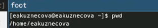{#fig:001 width=80%}

Перешла в каталог /tmp. Воспользовалась командой ls и посмотрела содержиме катала (рис. [-@fig:002]).

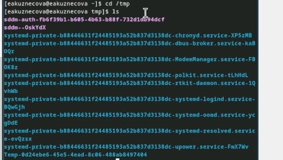{#fig:002 width=80%}

Воспользовалась командой ls -a. Показалось больше каталогов и файлов, вылезли скрытые каталоги и файлы (рис. [-@fig:003]).

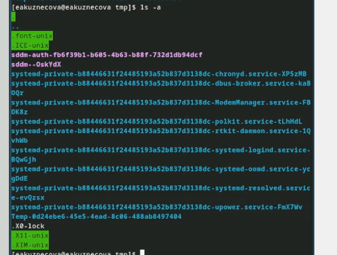{#fig:003 width=80%}

Воспользовалась командой ls -l. Получила более подробную информацию (рис. [-@fig:004]).

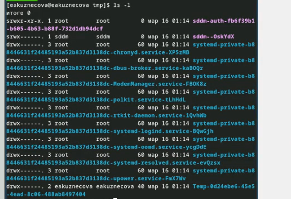{#fig:004 width=80%}

Воспользовалась командой ls -F. Узнала типы файлов (рис. [-@fig:005]).

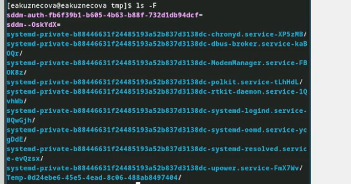{#fig:005 width=80%}

Воспользовалась командой ls -alF. Получила сразу все подробное описание (рис. [-@fig:006]).

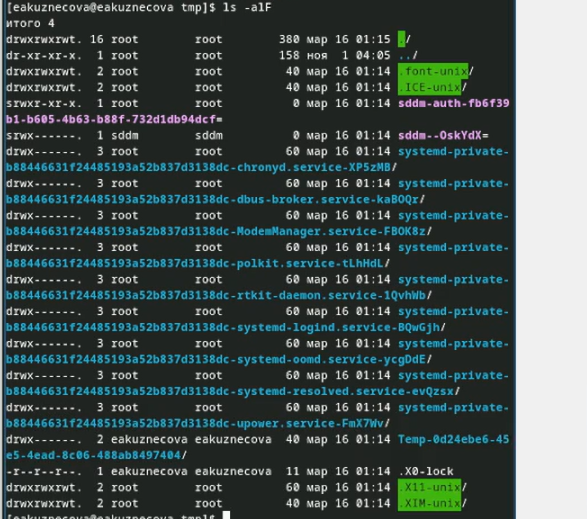{#fig:006 width=80%}

Ввела команду ls /var/spool/. Проверила есть ли в каталоге подкаталог с имернем cron. Подкаталог есть (рис. [-@fig:007]).

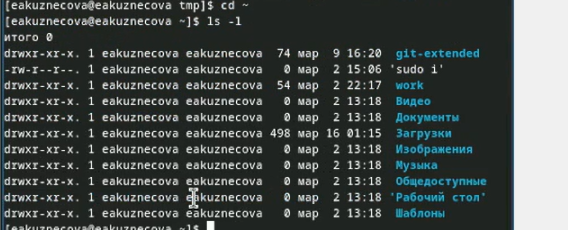{#fig:007 width=80%}

Перешла в домашний каталог. Вывела его содержимое. Пользователем является заданный мной ник (рис. [-@fig:008]).

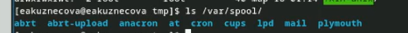{#fig:008 width=80%}

В домашнем каталоге создала новый каталог с именем newdir. В каталоге ~/newdir создала новый каталог с именем morefun. В домашнем каталоге создала одной командой три новых каталога с именами letters, memos, misk. Затем удалила эти каталоги одной командой. Попробовола удалить ранее созданный каталог ~/newdir командой rm. Каталог не был удален.Удалила каталог ~/newdir/morefun из домашнего каталога. Каталог был удален (рис. [-@fig:009]).

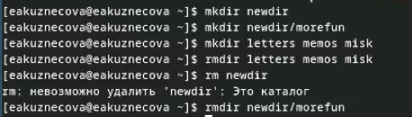{#fig:009 width=80%}

С помощью команды man определила, какую опцию команды ls нужно использо-
вать для просмотра содержимое не только указанного каталога, но и подкаталогов,
входящих в него (рис. [-@fig:010]).

{#fig:010 width=80%}

С помощью команды man определила набор опций команды ls, позволяющий отсорти-
ровать по времени последнего изменения выводимый список содержимого каталога
с развёрнутым описанием файлов (рис. [-@fig:011]).

{#fig:011 width=80%}

С помощью команды man определите набор опций команды ls, позволяющий отсорти-
ровать по времени последнего изменения выводимый список содержимого каталога
с развёрнутым описанием файлов (рис. [-@fig:012]).

{#fig:012 width=80%}

Воспользовалась совместной опцией -tl (рис. [-@fig:013]).

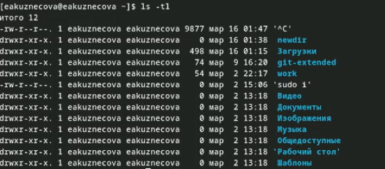{#fig:013 width=80%}

Использовала команду man для просмотра описания следующих команд: cd, pwd, mkdir,
rmdir, rm (рис. [-@fig:014]).

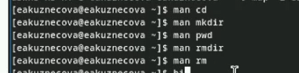{#fig:014 width=80%}

Воспользовалась командой history (рис. [-@fig:015]).

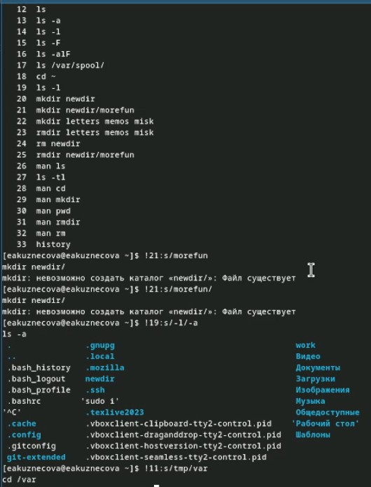{#fig:015 width=80%}

# Выводы

Овладела практическими навыками по взаимодествию с системой посредством командной строки.

